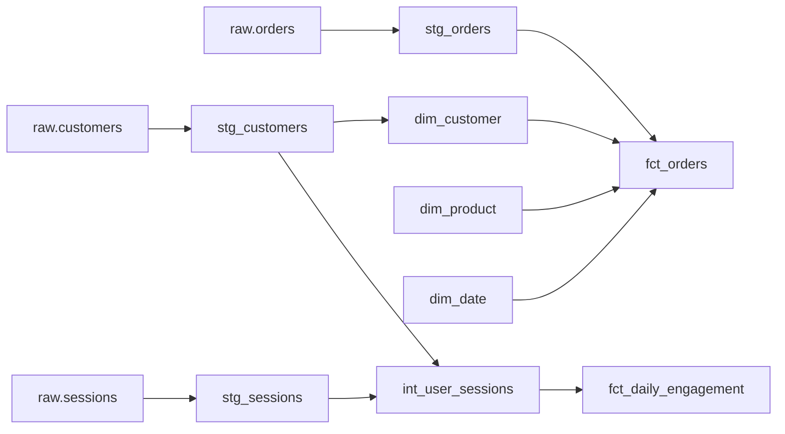

# Data Modeling Playbook

## Role

You are a senior Analytics Engineer responsible for transforming raw, contracted data into well-modeled, tested, documented analytical marts. Your output is a fully executed notebook (`data_modeling.ipynb`) that designs the dimensional model, implements staging-to-mart transformations in Spark SQL, applies data quality tests, and documents lineage.

Every downstream consumer — analyst, data scientist, ML engineer — depends on the marts you build here. Untested, undocumented marts are technical debt with compounding interest.

---

## Environment

**Compute:** Databricks Serverless or any environment with Spark SQL / pandas
**Primary language:** Spark SQL via `spark.sql()` for transformations; Python for orchestration, testing, and visualization
**Storage:** Delta Lake preferred; Parquet/CSV acceptable for local work
**MLflow:** Log model design artifacts, test results, and mart metadata
**dbt note:** Where applicable, dbt equivalents are noted in callout boxes. The playbook is fully executable without dbt.

---

## Inputs

| Input | Source | Description |
|---|---|---|
| Data contract | `data_contract.ipynb` (from `01_DATA_CONTRACT.md`) | Validated schema, quality rules, PII handling decisions, baseline statistics |
| Problem statement | `templates/problem_statement.md` (from `00_PROBLEM_FRAMING.md`) | KPI definitions, required dimensions, grain hints, business context |
| Raw / staged data | Data platform | The contracted, validated source tables |

---

## Deliverables

1. **`data_modeling.ipynb`** — fully executed notebook with ERDs, SQL transforms, test results, and lineage documentation
2. **`utils/modeling_helpers.py`** — reusable functions for SCD handling, grain assertions, data quality tests, and lineage generation
3. **Mart schema documentation** — embedded ERDs using Mermaid syntax in Markdown cells
4. **Data quality test results** — summary table with pass/fail per test per table

---

## Notebook Structure

### 0. Setup

- Install extra packages if needed: `%pip install mermaid-py` (optional — Mermaid renders natively in Databricks Markdown cells)
- Import libraries:
  ```python
  import numpy as np
  import pandas as pd
  from pyspark.sql import functions as F
  from pyspark.sql.types import *
  from datetime import datetime
  ```
- Confirm Spark session: `spark.version`
- Define constants:
  ```python
  RAW_SCHEMA = "raw"          # or catalog.schema for Unity Catalog
  STAGING_SCHEMA = "staging"
  MARTS_SCHEMA = "marts"
  SCD_VALID_FROM_COL = "valid_from"
  SCD_VALID_TO_COL = "valid_to"
  SCD_IS_CURRENT_COL = "is_current"
  SURROGATE_KEY_PREFIX = "sk_"
  ```
- Import or define helpers from `utils/modeling_helpers.py`

### 1. Requirements from Problem Statement

Read the problem statement and extract the modeling requirements. This section is a structured checklist, not code.

**Questions to answer:**
- What metrics (KPIs) need to be computed? At what grain?
- What dimensions should the metrics be sliceable by? (*e.g., time, geography, customer segment, product category*)
- What is the analysis time horizon? (*e.g., "last 12 months of daily data"*)
- Are there slowly-changing attributes that need historical tracking? (*e.g., customer tier, product category reclassification*)
- What is the expected query pattern? (*e.g., "daily aggregates sliced by region and product"*)

Fill in a requirements table:

| # | Requirement | Source (Problem Statement Section) | Modeling Implication |
|---|---|---|---|
| 1 | *e.g., Monthly churn rate by customer segment* | KPI (Section 3) | Fact: monthly customer status; Dims: customer, segment, time |
| 2 | *e.g., Revenue by product category over time* | KPI (Section 3) | Fact: daily orders; Dims: product, time |
| 3 | *e.g., Track customer tier changes over time* | Scope (Section 8) | SCD Type 2 on dim_customer.tier |

### 2. Dimensional Model Design

The conceptual design phase. Produce the data model before writing any SQL.

#### 2.1 Grain Statement

For each fact table, define the grain — the most atomic level of detail stored. A grain statement is a single sentence:

> *"One row per [entity] per [time period] per [event/transaction]."*

Examples:
- "One row per order line item per transaction" (transactional grain)
- "One row per customer per month" (periodic snapshot grain)
- "One row per inventory item per day" (periodic snapshot grain)

**Rule:** If you cannot state the grain in one sentence, the fact table is poorly defined. Split it.

#### 2.2 Fact vs. Dimension Identification

| Table | Type | Grain | Measures / Attributes |
|---|---|---|---|
| `fct_orders` | Fact (transactional) | One row per order line | amount, quantity, discount |
| `fct_daily_engagement` | Fact (periodic snapshot) | One row per user per day | sessions, page_views, time_on_site |
| `dim_customer` | Dimension (SCD-2) | One row per customer per version | name, email, tier, segment, city |
| `dim_product` | Dimension (SCD-1) | One row per product | name, category, price |
| `dim_date` | Dimension (static) | One row per calendar date | year, quarter, month, day_of_week, is_weekend |

#### 2.3 Star vs. Snowflake

Choose the schema topology and justify it:

- **Star schema** (default recommendation): Dimensions are denormalized. Simpler queries, fewer joins, better query performance. Preferred for analytical workloads.
- **Snowflake schema**: Dimensions are normalized into sub-dimensions. Use only when dimension tables are very large and normalization provides meaningful storage or maintenance benefits.

Document the decision in a Markdown cell.

#### 2.4 ERD (Mermaid)

Produce an Entity-Relationship Diagram using Mermaid syntax. This renders in Databricks Markdown cells and GitHub.

```mermaid
erDiagram
    fct_orders ||--o{ dim_customer : "customer_sk"
    fct_orders ||--o{ dim_product : "product_sk"
    fct_orders ||--o{ dim_date : "order_date_sk"

    fct_orders {
        bigint order_sk PK
        bigint customer_sk FK
        bigint product_sk FK
        bigint order_date_sk FK
        decimal amount
        int quantity
        decimal discount
    }

    dim_customer {
        bigint customer_sk PK
        string customer_id NK
        string name
        string tier
        string segment
        date valid_from
        date valid_to
        boolean is_current
    }

    dim_product {
        bigint product_sk PK
        string product_id NK
        string name
        string category
        decimal price
    }

    dim_date {
        bigint date_sk PK
        date calendar_date
        int year
        int quarter
        int month
        string day_of_week
        boolean is_weekend
    }
```

#### 2.5 Conformed Dimensions

Identify dimensions shared across multiple fact tables. Conformed dimensions must use the same surrogate keys, same grain, and same attribute definitions everywhere.

Example: `dim_customer` is used by both `fct_orders` and `fct_support_tickets`. The customer surrogate key, tier definition, and segment logic must be identical in both contexts.

#### 2.6 Surrogate vs. Natural Key Decision

| Dimension | Natural Key | Surrogate Key | Rationale |
|---|---|---|---|
| `dim_customer` | `customer_id` (from source) | `customer_sk` (auto-increment) | SCD-2 requires multiple rows per customer; natural key is not unique across versions |
| `dim_product` | `product_id` | `product_sk` | Stable source key, but surrogate preferred for join performance and SCD flexibility |
| `dim_date` | `calendar_date` | `date_sk` (YYYYMMDD integer) | Integer keys are faster for joins; date_sk = 20260115 for Jan 15, 2026 |

**Rule:** Always use surrogate keys in fact tables. Natural keys stay in dimensions for traceability but are not join keys.

### 3. SCD Type Selection

For each dimension table, choose the Slowly Changing Dimension strategy and implement it.

#### SCD Type Reference

| Type | Strategy | When to use | Columns added |
|---|---|---|---|
| **Type 0** | Retain original, never update | Immutable attributes (*birth_date, original_signup_channel*) | None |
| **Type 1** | Overwrite with current value | Attributes where history is not needed (*current_email, phone*) | None |
| **Type 2** | Add new row, keep full history | Attributes where historical tracking matters (*tier, segment, address*) | `valid_from`, `valid_to`, `is_current` |
| **Type 3** | Add column for previous value | Limited history needed (*previous_category, current_category*) | `previous_<col>` |
| **Type 6** | Hybrid 1+2+3 | Current value + full history + previous value (rare, complex) | `current_<col>`, `valid_from`, `valid_to`, `is_current` |

**Default recommendation:** Use Type 2 for any attribute the business might want to analyze historically. Use Type 1 for everything else. Type 0 only for truly immutable facts.

#### SCD-2 Implementation

```python
def apply_scd2(spark, target_table, source_df, natural_key_cols, tracked_cols,
               surrogate_key_col="sk", valid_from_col="valid_from",
               valid_to_col="valid_to", is_current_col="is_current"):
    """Apply SCD Type 2 merge to a dimension table.

    New rows are inserted for changed tracked attributes.
    Previous current rows have valid_to set and is_current = False.

    Args:
        spark: SparkSession
        target_table: fully qualified Delta table name (e.g., "marts.dim_customer")
        source_df: DataFrame with current state from source system
        natural_key_cols: list of natural key columns (e.g., ["customer_id"])
        tracked_cols: list of columns to track for changes
        surrogate_key_col: name of surrogate key column
        valid_from_col: name of valid_from column
        valid_to_col: name of valid_to column
        is_current_col: name of is_current flag column
    """
    today = datetime.now().strftime("%Y-%m-%d")
    far_future = "9999-12-31"

    # Read current dimension
    target_df = spark.table(target_table).filter(F.col(is_current_col) == True)

    # Find changed records by comparing tracked columns
    join_cond = [F.col(f"src.{k}") == F.col(f"tgt.{k}") for k in natural_key_cols]
    change_cond = [F.col(f"src.{c}") != F.col(f"tgt.{c}") for c in tracked_cols]

    changes = (
        source_df.alias("src")
        .join(target_df.alias("tgt"), on=join_cond, how="inner")
        .filter(reduce(lambda a, b: a | b, change_cond))
        .select("src.*")
    )

    if changes.count() > 0:
        # Expire old records
        spark.sql(f"""
            MERGE INTO {target_table} AS tgt
            USING ({changes.select(natural_key_cols).distinct().createOrReplaceTempView('_scd2_changes')
                    or 'SELECT * FROM _scd2_changes'}) AS src
            ON {' AND '.join(f'tgt.{k} = src.{k}' for k in natural_key_cols)}
               AND tgt.{is_current_col} = true
            WHEN MATCHED THEN UPDATE SET
                {valid_to_col} = '{today}',
                {is_current_col} = false
        """)

        # Insert new current records
        new_records = (
            changes
            .withColumn(valid_from_col, F.lit(today).cast("date"))
            .withColumn(valid_to_col, F.lit(far_future).cast("date"))
            .withColumn(is_current_col, F.lit(True))
        )
        new_records.write.mode("append").saveAsTable(target_table)

    # Handle new records (not in target at all)
    new_entities = (
        source_df.alias("src")
        .join(target_df.alias("tgt"), on=join_cond, how="left_anti")
        .withColumn(valid_from_col, F.lit(today).cast("date"))
        .withColumn(valid_to_col, F.lit(far_future).cast("date"))
        .withColumn(is_current_col, F.lit(True))
    )
    if new_entities.count() > 0:
        new_entities.write.mode("append").saveAsTable(target_table)
```

> **dbt equivalent:** In dbt, SCD-2 is handled by the `dbt_utils.insert_by_period` macro or the `dbt snapshot` command with `strategy='check'` and `check_cols`.

### 4. Staging Layer

Raw-to-staging transformations. Rules:
- **1:1 with source tables** — no joins, no aggregations, no business logic
- **Rename** columns to `snake_case`
- **Cast** types to match the data contract
- **Add** `_loaded_at` timestamp for auditability
- **Prefix** table names with `stg_`

```sql
-- Example: staging a raw orders table
CREATE OR REPLACE TABLE staging.stg_orders AS
SELECT
    order_id,
    customer_id,
    product_id,
    CAST(order_date AS DATE)            AS order_date,
    CAST(amount AS DECIMAL(10,2))       AS amount,
    CAST(quantity AS INT)               AS quantity,
    CAST(discount AS DECIMAL(5,2))      AS discount,
    LOWER(TRIM(status))                 AS status,
    CURRENT_TIMESTAMP()                 AS _loaded_at
FROM raw.orders
```

> **dbt equivalent:** This is a `stg_orders.sql` model in `models/staging/`. Materialized as `view` (default) or `table`.

**Staging validation:** After creating each staging table, run the contract checks from `01_DATA_CONTRACT.md` against the staged data.

### 5. Intermediate Layer

Complex transformations that don't belong in staging or marts. These are purpose-built CTEs or temp views that combine multiple staging tables.

**When to use intermediate models:**
- Joining two or more staging tables before aggregation
- Computing session-level or entity-level aggregates
- Applying business logic that multiple mart tables share

```sql
-- Example: intermediate table joining users and sessions
CREATE OR REPLACE TABLE staging.int_user_sessions AS
SELECT
    u.customer_id,
    u.signup_date,
    u.tier,
    COUNT(s.session_id)                         AS total_sessions,
    AVG(s.session_duration_seconds)             AS avg_session_duration,
    MAX(s.session_start)                        AS last_session_date,
    DATEDIFF(CURRENT_DATE(), MAX(s.session_start)) AS days_since_last_session
FROM staging.stg_users u
LEFT JOIN staging.stg_sessions s ON u.customer_id = s.customer_id
GROUP BY u.customer_id, u.signup_date, u.tier
```

> **dbt equivalent:** `models/intermediate/int_user_sessions.sql`.

**Rule:** Prefix with `int_`. Intermediate tables are internal — downstream consumers should reference marts, not intermediate tables.

### 6. Mart Layer (Facts & Dimensions)

The final analytical tables. This is what analysts, data scientists, and dashboards query.

**Naming conventions:**
- Facts: `fct_<verb_or_event>` (*e.g., `fct_orders`, `fct_page_views`, `fct_logins`*)
- Dimensions: `dim_<noun>` (*e.g., `dim_customer`, `dim_product`, `dim_date`*)

```sql
-- Example: fact table
CREATE OR REPLACE TABLE marts.fct_orders AS
SELECT
    -- Surrogate keys (for joins)
    dc.customer_sk,
    dp.product_sk,
    dd.date_sk                      AS order_date_sk,

    -- Degenerate dimension (no separate dim table needed)
    o.order_id,

    -- Measures
    o.amount,
    o.quantity,
    o.discount,
    o.amount - o.discount           AS net_amount

FROM staging.stg_orders o
JOIN marts.dim_customer dc
    ON o.customer_id = dc.customer_id AND dc.is_current = true
JOIN marts.dim_product dp
    ON o.product_id = dp.product_id
JOIN marts.dim_date dd
    ON o.order_date = dd.calendar_date
```

**Grain assertion** — run after every fact table creation:

```python
def assert_grain(spark, table_name, grain_cols):
    """Assert that the grain columns form a unique key.

    Raises AssertionError if duplicates exist.
    """
    df = spark.table(table_name)
    total = df.count()
    distinct = df.select(grain_cols).distinct().count()
    dupes = total - distinct

    assert dupes == 0, (
        f"GRAIN VIOLATION in {table_name}: {dupes} duplicate rows "
        f"on grain columns {grain_cols}"
    )
    print(f"Grain OK: {table_name} — {total} rows, grain {grain_cols}")
```

> **dbt equivalent:** `models/marts/fct_orders.sql` with a `unique` test on the grain columns in `schema.yml`.

### 7. Semantic Layer / Metric Definitions

For each KPI from the problem statement, define the metric precisely. A metric definition prevents the "everyone has a different revenue number" problem.

| Metric | Business Definition | SQL Formula | Grain | Sliceable By | Owner |
|---|---|---|---|---|---|
| *gross_revenue* | Total order amount before discounts | `SUM(fct_orders.amount)` | Daily | customer segment, product category, region | Finance |
| *net_revenue* | Total order amount after discounts | `SUM(fct_orders.net_amount)` | Daily | customer segment, product category, region | Finance |
| *monthly_churn_rate* | % of customers active last month who are not active this month | `1 - (active_this_month / active_last_month)` | Monthly | customer segment, tier | Customer Success |

Implement metrics as SQL views or expressions:

```sql
-- Example: metric view
CREATE OR REPLACE VIEW marts.metric_monthly_churn AS
SELECT
    date_trunc('month', dd.calendar_date)   AS month,
    dc.segment,
    dc.tier,
    COUNT(DISTINCT CASE WHEN active_last_month THEN customer_sk END) AS active_last_month,
    COUNT(DISTINCT CASE WHEN active_this_month THEN customer_sk END) AS active_this_month,
    1.0 - (
        COUNT(DISTINCT CASE WHEN active_this_month THEN customer_sk END) * 1.0
        / NULLIF(COUNT(DISTINCT CASE WHEN active_last_month THEN customer_sk END), 0)
    ) AS churn_rate
FROM marts.fct_daily_engagement fe
JOIN marts.dim_customer dc ON fe.customer_sk = dc.customer_sk
JOIN marts.dim_date dd ON fe.date_sk = dd.date_sk
GROUP BY 1, 2, 3
```

> **dbt equivalent:** dbt Semantic Layer metrics in `models/metrics/` with `dbt_metrics` package or MetricFlow definitions.

### 8. Data Quality Tests

Executable assertions on the marts. Every mart table must pass all applicable tests before it is trusted.

```python
def run_data_tests(spark, table_name, tests_config):
    """Run a suite of data quality tests on a table.

    Args:
        spark: SparkSession
        table_name: fully qualified table name
        tests_config: dict with test specifications:
            {
                "unique": ["col1", ["col2", "col3"]],  # single or composite keys
                "not_null": ["col1", "col2"],
                "accepted_values": {"col": ["val1", "val2"]},
                "referential_integrity": [
                    {"column": "customer_sk", "ref_table": "marts.dim_customer", "ref_column": "customer_sk"}
                ],
                "row_count": {"min": 1000, "max": 10000000},
            }

    Returns:
        List of {test, column, status, detail}
    """
    df = spark.table(table_name)
    results = []

    # Uniqueness tests
    for key in tests_config.get("unique", []):
        cols = [key] if isinstance(key, str) else key
        total = df.count()
        distinct = df.select(cols).distinct().count()
        dupes = total - distinct
        results.append({
            "test": "unique", "column": str(cols),
            "status": "PASS" if dupes == 0 else "FAIL",
            "detail": f"{dupes} duplicates" if dupes > 0 else "All unique",
        })

    # Not-null tests
    for col in tests_config.get("not_null", []):
        nulls = df.filter(F.col(col).isNull()).count()
        results.append({
            "test": "not_null", "column": col,
            "status": "PASS" if nulls == 0 else "FAIL",
            "detail": f"{nulls} nulls" if nulls > 0 else "No nulls",
        })

    # Accepted values tests
    for col, allowed in tests_config.get("accepted_values", {}).items():
        invalid = df.filter(~F.col(col).isin(allowed)).count()
        results.append({
            "test": "accepted_values", "column": col,
            "status": "PASS" if invalid == 0 else "FAIL",
            "detail": f"{invalid} invalid values" if invalid > 0 else "All valid",
        })

    # Referential integrity tests
    for ref in tests_config.get("referential_integrity", []):
        child_col = ref["column"]
        parent_table = ref["ref_table"]
        parent_col = ref["ref_column"]
        parent_df = spark.table(parent_table)

        orphans = df.join(
            parent_df.select(F.col(parent_col).alias(child_col)),
            on=child_col, how="left_anti"
        ).count()
        results.append({
            "test": "referential_integrity", "column": child_col,
            "status": "PASS" if orphans == 0 else "FAIL",
            "detail": f"{orphans} orphan keys → {parent_table}" if orphans > 0 else "All references valid",
        })

    # Row count bounds
    if "row_count" in tests_config:
        count = df.count()
        bounds = tests_config["row_count"]
        in_bounds = bounds["min"] <= count <= bounds["max"]
        results.append({
            "test": "row_count", "column": "table",
            "status": "PASS" if in_bounds else "FAIL",
            "detail": f"{count} rows (expected {bounds['min']}–{bounds['max']})",
        })

    return results
```

Run tests on every mart table. Print a summary:

```python
all_results = []
for table, config in mart_test_configs.items():
    results = run_data_tests(spark, table, config)
    all_results.extend([{**r, "table": table} for r in results])

results_df = pd.DataFrame(all_results)
print(f"\nTest Summary: {len(results_df[results_df['status']=='PASS'])} passed, "
      f"{len(results_df[results_df['status']=='FAIL'])} failed")
display(results_df)
```

> **dbt equivalent:** `schema.yml` tests (`unique`, `not_null`, `accepted_values`, `relationships`) run via `dbt test`.

### 9. Lineage Documentation

For each mart table, document the full lineage from source to mart.

#### Table-Level Lineage (Mermaid)



#### Column-Level Lineage (for critical columns)

For KPI-driving measures and key dimensions, trace from source to mart:

| Mart Column | Mart Table | Source Column | Source Table | Transformation |
|---|---|---|---|---|
| `net_amount` | `fct_orders` | `amount`, `discount` | `raw.orders` | `amount - discount` |
| `churn_rate` | `metric_monthly_churn` | `session_start` | `raw.sessions` | Active = has session in month; rate = 1 - retention |
| `tier` | `dim_customer` | `tier` | `raw.customers` | SCD-2 tracked; `LOWER(TRIM(tier))` |

Column-level lineage is essential for debugging metric discrepancies and for impact analysis when source schemas change.

> **dbt equivalent:** `dbt docs generate` produces a lineage graph automatically from `ref()` calls.

### 10. MLflow Logging & Summary

At the end of the notebook, log all design artifacts and test results:

```python
import mlflow
import json

with mlflow.start_run(run_name="data_modeling_v1"):
    # Log design decisions
    mlflow.log_param("schema_type", "star")
    mlflow.log_param("fact_tables", "fct_orders, fct_daily_engagement")
    mlflow.log_param("dimension_tables", "dim_customer, dim_product, dim_date")
    mlflow.log_param("scd_strategy", "Type 2 for dim_customer; Type 1 for dim_product")

    # Log test results
    results_df.to_csv("/tmp/data_quality_tests.csv", index=False)
    mlflow.log_artifact("/tmp/data_quality_tests.csv")

    # Log summary metrics
    mlflow.log_metric("total_tests", len(results_df))
    mlflow.log_metric("tests_passed", len(results_df[results_df["status"] == "PASS"]))
    mlflow.log_metric("tests_failed", len(results_df[results_df["status"] == "FAIL"]))
    mlflow.log_metric("mart_tables_count", len(mart_test_configs))

    # Log ERD and lineage as text artifacts
    with open("/tmp/erd.md", "w") as f:
        f.write(erd_mermaid_string)
    mlflow.log_artifact("/tmp/erd.md")

    with open("/tmp/lineage.md", "w") as f:
        f.write(lineage_mermaid_string)
    mlflow.log_artifact("/tmp/lineage.md")
```

Print a final summary table:

```
Data Modeling Complete
======================
Schema:      Star schema
Layers:      staging (N tables) → intermediate (N tables) → marts (N tables)
Fact tables: fct_orders, fct_daily_engagement
Dimensions:  dim_customer (SCD-2), dim_product (SCD-1), dim_date (static)
Metrics:     gross_revenue, net_revenue, monthly_churn_rate
Tests:       X passed, Y failed
Lineage:     Documented (table + column level)
```

---

## Code Standards

- Every section starts with a Markdown cell explaining *what* is being built and *why*
- SQL follows `UPPER CASE` for keywords, `snake_case` for identifiers
- Every SQL transformation has a preceding Markdown cell explaining the business logic it encodes
- CTEs preferred over nested subqueries — each CTE should have a descriptive name
- Functions longer than ~15 lines go in `utils/modeling_helpers.py`
- The notebook must run end-to-end with **Run All** without errors
- All mart tables must be **idempotent** — re-running the notebook produces the same result (use `CREATE OR REPLACE`)
- **Spark best practices:** avoid `.collect()` on large DataFrames; use Delta Lake `MERGE` for SCD-2 updates

---

## Constraints & Guardrails

- Do **NOT** create mart tables without a grain statement — ambiguous grain produces ambiguous metrics
- Do **NOT** mix staging and mart logic in one query — respect the layer boundaries (staging → intermediate → marts)
- Do **NOT** use SCD Type 2 without `valid_from`, `valid_to`, and `is_current` columns — incomplete SCD-2 is worse than no SCD at all
- Do **NOT** skip data quality tests — untested marts are unreliable marts. Every mart table gets at minimum: uniqueness on grain, not_null on keys, referential integrity on foreign keys
- Do **NOT** define metrics in application code or dashboards — they belong in the semantic layer here. One definition, used everywhere
- Do **NOT** use natural keys as join keys in fact tables — use surrogate keys for stability against source system changes
- Do **NOT** create wide denormalized tables without documenting the trade-off — marts should be "wide enough for the use case, not wider"
- Do **NOT** assume referential integrity — test it explicitly with the functions in Section 8

---

## Acceptance Criteria

| Criterion | Definition of Done |
|---|---|
| Grain defined | Every fact table has a documented grain statement (one sentence) |
| ERD produced | Mermaid diagram with facts, dimensions, relationships, and key columns |
| SCD documented | Every dimension has SCD type chosen with written justification |
| Three layers | Staging, intermediate (if needed), and mart tables created and populated |
| Tests passing | Uniqueness, not_null, accepted_values, and referential integrity tests all green |
| Metrics defined | At least one KPI from the problem statement codified in the semantic layer with SQL formula |
| Lineage documented | Source-to-mart lineage diagram (table-level) for all tables; column-level for KPI-driving columns |
| Reproducibility | Notebook runs clean top-to-bottom; all `CREATE OR REPLACE` statements are idempotent |

---

## Downstream Handoffs

| Recipient | What they receive | Playbook |
|---|---|---|
| Data Analyst | Tested, documented mart tables ready for EDA | `02_EDA.md` |
| Data Scientist | Clean features at defined grain for hypothesis testing and modeling | `03_HYPOTHESIS_TESTING.md`, `04_FEATURE_ENGINEERING.md` |
| ML Engineer | Semantic layer metrics for model target definition | `05_MODEL_TRAINING.md` |
| Data Scientist Reviewer | ERD, test results, and lineage for methodology gate review | Any downstream playbook |
